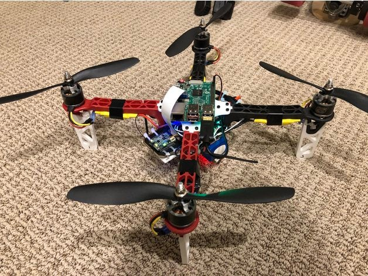

# R.Pi Quad_X (Quadcopter Project)
Websocket and MultiWii serial code to control a quadcopter, running on a Raspberry Pi.



PiQuadcopter based Project, running on the Raspberry Pi. Note: that I've used the Raspberry Pi 3 but it was originally tested on a Raspberry Pi 2 according to Richard Wendel.

## Overview of all the tech

- The first thing to do is to create a hosted Wi-Fi network. To accomplish this we use [`isc-dhcp-server`](https://help.ubuntu.com/community/isc-dhcp-server) and [`hostapd`](https://w1.fi/hostapd/)
  - `isc-dhcp-server` serves as the DHCP server for our Wi-Fi network
  - `hostapd` serves as access point management, essentially making a Wi-Fi card into a router
- Now for communication with our MultiWii device. There is the [C library](https://github.com/rgw3d/cMultiWii) with the [MSP protocol](http://www.multiwii.com/wiki/index.php?title=Multiwii_Serial_Protocol), and I use a backbone library [`libserialport`](https://sigrok.org/wiki/Libserialport)
  - `libserialport` is downloaded from their git repository, and installed
  - `cMultiWii`, my MSP implementation is downloaded from the git repository. This will be compiled later
- Websocket communication is needed next. I use the [`websocketpp`](https://github.com/zaphoyd/websocketpp) library, implemented in this repo.
  - `websocketpp` is not installed. It is a header-only library (.hpp), and is compiled each time (with the intention of improving performance)
- Compiling websocket.cpp in this repo will build the executable that will recieve commands from a remote control, and then relay them to the MultiWii. It compiles the `websocketpp` library which takes along time, and the `cMultiWii` library which is quick to compile.


## Instructions to set up your Pi with all of the software it needs:

- Download/clone this repo
- Run `setup_pi_software.sh`, which will install `libserialport`, `isc-dhcp-server`, `hostapd`, and download `cMultiWii`, `websocketpp`. It will also compile the websocket server
  - You need to check to see if your MultiWii is `/dev/ttyUSB0`. Check the troubleshooting section for more information
- Since your network configuration and device might be different, your `/etc/network/interfaces`, `/etc/default/isc-dhcp-server`, and `/etc/dhcp/dhcpd.conf` files are not automatically modified.
- Add the following configuration to your `/etc/network/interfaces` file in order for `hostapd` to work. Also, remove any reference to `wpa_supplicant`, as it causes issues with `hostapd`
```
allow-hotplug wlan0
iface wlan0 inet static
  address 192.168.10.1
  netmask 255.255.255.0
  gateway 192.168.10.1
```

- Add the following configuration to your `/etc/default/isc-dhcp-server` file in order for `isc-dhcp-server` to know what device to use
```
INTERFACES="wlan0"
```
- Add the following configuration to your `/etc/dhcp/dhcpd.conf` file in order for `isc-dhcp-server` to know what subnet to use
```
subnet 192.168.10.0 netmask 255.255.255.0 {
    range 192.168.10.1 192.168.10.30;
}
```
- You need to ensure `wlan0` and `hostapd.conf` are correct. Check the troubleshooting section for more information

## Running the program and automatic startup

- I would suggest a reboot after all of the installation process
- To start up the hosted network and the websocket, run `sudo ./piquadserver.sh`
- To schedule everything to start up automatically on boot, edit `/etc/rc.local` with something like `/home/path/to/piquadserver.sh` but if that doesn't work as it didn't for me, use a relative path like I did with something like: `cd home/pi/PiQuadcopter/
./piquadserver.sh &
exit 0`
  - rc.local is called automatically on startup. 
  - Check troubleshooting for more help

## Troubleshooting

- To find your wireless interface, run `ifconfig`
- To find your USB device, run `dmesg | grep ttyUSB`  and look for what number it is
  - Once you find your device, you will need to edit line 4 of `configure_port.c` within `cMultiWii` to reflect the proper device. You will have to recompile.
- If your wireless interface is not `wlan0`, then you will have to change it in your `interfaces` file, and in `hostapd.conf`
- Check `/etc/hostapd/hostapd.conf` for hostapd configurations, and make sure they match your `interfaces` configuration
- If `hostapd` is throwing errors similar to: `n180211: Could not configure driver mode` ... then you probably need to kill the instance of hostapd already running. 
  - Run `ps -A` to view all active processes
  - Find the process ID number for `hostapd`
  - `sudo kill <process ID>` will kill hostapd and hopefully resolve the issue
- If there are any problems with `isc-dhcp-server`, try running `sudo journalctl -u isc-dhcp-server.service` to look for errors
- If you need to recompile at any time, just run `make` at the top level of this repository.


## APK For Android Smartphone

- You can find the following Application for your Android Smartphone [here](https://github.com/robert-solomon12/QuadcopterController).


<br> Should you have any problems, don't hesitate to contact me on my email at:</br> [20079462@mail.wit.ie](mailto:20079462@mail.wit.ie)
<br>or if you find a bug </br>[open up an issue here](https://github.com/EazyRob97/PiQuadcopter-master/issues)
